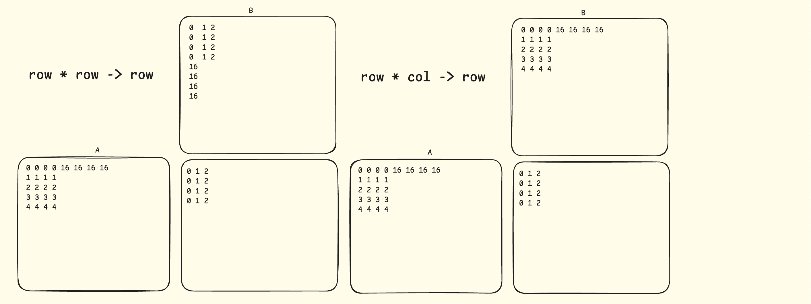

# learn hip asm and matmul through hiprtc.

## ref:
gau's hip gemm: https://github.com/gau-nernst/learn-cuda/tree/main/02c_matmul_hip

shark-ai's amdgpu kernel optimization guide: https://github.com/nod-ai/shark-ai/blob/main/docs/amdgpu_kernel_optimization_guide.md#mi300

## gemm target: 
> `592 TFlops` on NTN shapes, and `654 TFlops` on TNT shapes
script from https://github.com/ROCm/tritonBLAS/blob/main/tools/sweep_grid.py
```python
Problem size: 4864x4096x4096 (transA=T, transB=N)
Best tile: (256, 256, 32) → 654.101 TFLOPS ⭐️⭐️⭐️
Heuristic tile: (256, 256, 64) → 621.040 TFLOPS

Problem size: 4864x4096x4096 (transA=N, transB=T)
Best tile: (256, 256, 64) → 592.116 TFLOPS ⭐️⭐️⭐️
Heuristic tile: (256, 256, 64) → 590.764 TFLOPS
```


## code: 
#### `00_add.hip`: add kernel, for testing hipasm. and learning: 
- add some simple asm code here?
#### `00_add_2.hip`: add kernel 2
add some builtin_assume here to skip the check of the original add kernel asms.
```c++
__launch_bounds__(256)

__builtin_assume(N >= 2048);
__builtin_assume(N <= 4096);
__builtin_assume(N % 1024 == 0);  // 如果是256倍数
```
#### `01_mfma.hip` of `test_bf16_matmul_NNN`
- code from https://github.com/amd/amd-lab-notes/blob/release/matrix-cores/src/mfma_fp32_32x32x8fp16.cpp
- simple code to show how to use hip matrix core instructions.
- it's a builtin function, not inline assembly version though.

```c++
d = __builtin_amdgcn_mfma_f32_16x16x16f16(a, b, d, 0, 0, 0);
//                                        ^  ^  ^
//D(=C)                                   |  |  C(=D)
//                      16 columns of A---|  |--- 16 rows of B
```


also `fp16_gemm_16x16x16_NTN` below to make B transpose, then we can use `4 * fp16 -> b64` load instructions to load B.

should be more throughput? try find a microbenchmark to test it.



- [ ] TODO: make NTN to another file? and also add some microbenchmark to test it.

#### TODO: chang it to a version with shared memory?
as our shape: 32 * 32 * 64 & 32 * 32 * 32

